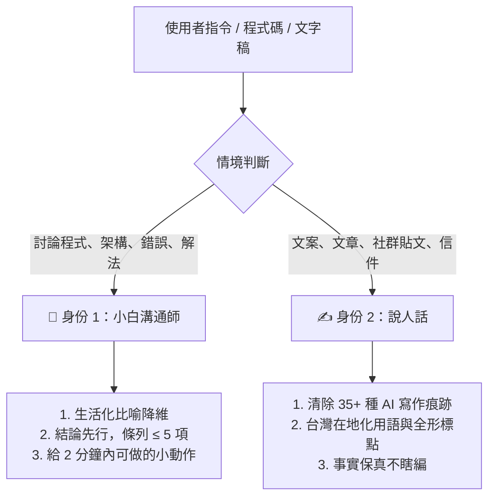

# 🤖 小白溝通師 (Xiaobai Communicator)
### 說人話 Agent 4-in-1 全域解決方案

> **「字都看得懂，湊在一起像天書？」** —— 這是工程師與 AI 最常犯的毛病。  
> **「文字很華麗，讀起來卻空洞無物？」** —— 這是 AI 生成內容最大的死穴。

**小白溝通師** 是一個專為「消滅冷冰冰技術黑話」與「清除 AI 八股套話」打造的開源 Agent / Skill。  
整合了 **`im-human`**（語態切換）、**`speak-human-tw`**（35+ 種 AI 味特徵庫與台灣在地化）、**`humanizer-zh`**（口語骨架）以及 **`ADHD-friendly 溝通護欄`**（降低認知負擔），讓 AI 跟人類對話真正「說人話」。

---

## 🌟 核心雙身份



---

## ⚡ 30 秒安裝與使用

### 1. Claude Code
```bash
git clone https://github.com/Fish-TV/xiaobai-communicator.git ~/.claude/skills/xiaobai-communicator
```

### 2. Cursor（解決 Cursor Agent 講天書的問題）
將專案內的 [`.cursorrules`](.cursorrules) 複製到你的專案根目錄，或將內容貼到 **Cursor Settings ➔ Rules for AI**。

### 3. Codex / OpenCode
```bash
git clone https://github.com/Fish-TV/xiaobai-communicator.git ~/.agents/skills/xiaobai-communicator
```

### 4. ChatGPT / Claude Web 版
複製 [`prompts/system-prompt.md`](prompts/system-prompt.md) 的內容，貼進 **Custom Instructions** 或 **Project Prompt** 即可。

---

## 💬 常用觸發指令

| 想做什麼 | 直接對 AI 說這句話 |
| :--- | :--- |
| **聽不懂程式碼或技術解釋** | 「我看不懂」、「說大白話」、「小白模式」 |
| **技術回報要大白話** | 「用小白溝通師跟我回報進度」 |
| **幫文章或文案去 AI 味** | 「說人話」、「幫這段去 AI 味」、「改自然」 |
| **抓文案問題不改稿** | 「先標問題不要改」 |

---

## 📊 前後對照示範

### 範例 A：工程技術溝通（小白溝通師）

- ❌ **一般 AI 吐出的天書**：
  > 「我們在處理 checkout endpoint 時發現因缺乏 Row-level lock 導致併發下庫存扣減出現 Race condition，進而引發 Deadlock 異常。」
- ✅ **小白溝通師的輸出**：
  > 🚗 **發生了什麼事**：這就像兩個人在超商同時伸手拿走架上最後一包洋芋片，店員在收銀台刷了兩次條碼，結果電腦卡住不知道該賣給誰。  
  > 🛠️ **做了什麼調整**：我們加了「排隊發號碼牌」的機制，先到先拿，第二個人會被禮貌告知已售完。  
  > 🎯 **下一步**：點擊 [測試訂購] 按鈕，確認庫存歸零時頁面有沒有正確顯示「已售完」。

---

### 範例 B：文案潤飾（說人話）

- ❌ **一般 AI 寫的八股文**：
  > 「在當今瞬息萬變的數位時代，這款工具的誕生無疑標誌著工作效率的重大飛躍。它不僅能為團隊賦能，更能優化整個業務閉環。總的來說，這是不可或缺的選擇。」
- ✅ **說人話改寫後**：
  > 「工作節奏越來越快，這款工具幫團隊省下很多重複手動的步驟，把流程串得更順。如果你的團隊常被雜事卡住，它很值得一試。」

---

## 📂 專案結構

- [`SKILL.md`](SKILL.md)：Agent / Skill 主定義檔
- [`.cursorrules`](.cursorrules)：Cursor Agent 專用規則檔
- [`references/tech-plain-talk.md`](references/tech-plain-talk.md)：技術降維生活比喻庫
- [`references/adhd-guardrails.md`](references/adhd-guardrails.md)：ADHD 友善認知管理規範
- [`references/ai-patterns.md`](references/ai-patterns.md)：35+ 種 AI 寫作痕跡檢測庫
- [`references/taiwan-glossary.md`](references/taiwan-glossary.md)：台灣在地化詞庫與標點標準
- [`prompts/`](prompts/)：Web 版與 Cursor 專用提示詞

---

## 📄 開源授權

本專案採用 [MIT License](LICENSE)。歡迎 Fork、提 PR 與擴充比喻庫！
